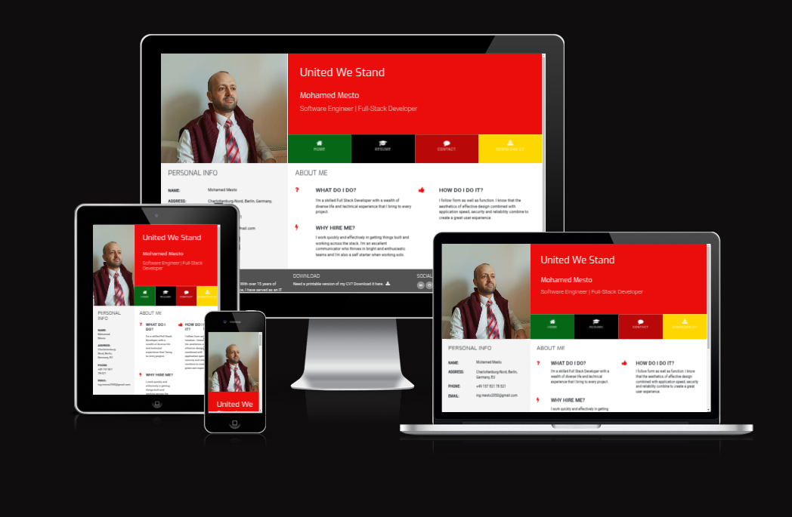

[](https://mohamedmesto.github.io/Un2050_resume/)


[](https://un2050.de/)


Welcome,
 

# Un2050  

## Welcome

Welcome to **UN2050**, a visionary platform designed to foster innovation, sustainability, and community-driven progress. Built with the latest web technologies, UN2050 serves as a digital hub where users can explore, connect, and collaborate on projects that shape a better future. Whether you’re interested in cutting-edge technology, social impact, or creative initiatives, UN2050 provides a seamless experience for engaging with transformative ideas and solutions. Our platform is a space for thought leaders, innovators, and changemakers to share their insights, learn from one another, and drive positive change. Join us on this journey to build a sustainable, inclusive world by 2050 and beyond!

[Here is the live version of the project on GitHub](https://mohamedmesto.github.io/Un2050_resume/)


[Here is the link to our Website](https://un2050.de/)


 

 ---


```  
Un2050 app/
│
├── public/
│
├── src/
│   ├── assets/
│   ├── components/
│   │   ├── Home.js
│   │   ├── OurProjects.js
│   │   ├── OurTeam.js
│   │   ├── AboutMe.js
│   │   ├── Portfolio.js
│   │   ├── MediaHub.js
│   │   ├── ContactUs.js
│   │   └── ...
│   ├── locales/
│   │   ├── en/
│   │   │   ├── home.json
│   │   │   ├── projects.json
│   │   │   ├── team.json
│   │   │   ├── about_me.json
│   │   │   ├── portfolio.json
│   │   │   ├── media_hub.json
│   │   │   └── contact_us.json
│   │   ├── de/
│   │   │   ├── home.json
│   │   │   ├── projects.json
│   │   │   ├── team.json
│   │   │   ├── about_me.json
│   │   │   ├── portfolio.json
│   │   │   ├── media_hub.json
│   │   │   └── contact_us.json
│   ├── App.js
│   ├── index.js
│   ├── i18n.js  <-- This is where i18n.js is located
│   └── ...
├── package.json
├── package-lock.json

```


 
Color:#bd0d0d

```
 npm install i18next-browser-languagedetector
```

# …or create a new repository on the command line
```
echo "# un2050" >> README.md
git init
git add README.md
git commit -m "first commit"
git branch -M main
git remote add origin https://github.com/MohamedMesto/un2050.git
git push -u origin main
```

# or push an existing repository from the command line
```
git remote add origin https://github.com/MohamedMesto/un2050.git
git branch -M main
git push -u origin main
```

# Getting Started with Create React App

This project was bootstrapped with [Create React App](https://github.com/facebook/create-react-app).

## Available Scripts

In the project directory, you can run:

### `npm start`

Runs the app in the development mode.\
Open [http://localhost:3000](http://localhost:3000) to view it in your browser.

The page will reload when you make changes.\
You may also see any lint errors in the console.

### `npm test`

Launches the test runner in the interactive watch mode.\
See the section about [running tests](https://facebook.github.io/create-react-app/docs/running-tests) for more information.

### `npm run build`

Builds the app for production to the `build` folder.\
It correctly bundles React in production mode and optimizes the build for the best performance.

The build is minified and the filenames include the hashes.\
Your app is ready to be deployed!

See the section about [deployment](https://facebook.github.io/create-react-app/docs/deployment) for more information.

### `npm run eject`

**Note: this is a one-way operation. Once you `eject`, you can't go back!**

If you aren't satisfied with the build tool and configuration choices, you can `eject` at any time. This command will remove the single build dependency from your project.

Instead, it will copy all the configuration files and the transitive dependencies (webpack, Babel, ESLint, etc) right into your project so you have full control over them. All of the commands except `eject` will still work, but they will point to the copied scripts so you can tweak them. At this point you're on your own.

You don't have to ever use `eject`. The curated feature set is suitable for small and middle deployments, and you shouldn't feel obligated to use this feature. However we understand that this tool wouldn't be useful if you couldn't customize it when you are ready for it.

## Learn More

You can learn more in the [Create React App documentation](https://facebook.github.io/create-react-app/docs/getting-started).

To learn React, check out the [React documentation](https://reactjs.org/).

### Code Splitting

This section has moved here: [https://facebook.github.io/create-react-app/docs/code-splitting](https://facebook.github.io/create-react-app/docs/code-splitting)

### Analyzing the Bundle Size

This section has moved here: [https://facebook.github.io/create-react-app/docs/analyzing-the-bundle-size](https://facebook.github.io/create-react-app/docs/analyzing-the-bundle-size)

### Making a Progressive Web App

This section has moved here: [https://facebook.github.io/create-react-app/docs/making-a-progressive-web-app](https://facebook.github.io/create-react-app/docs/making-a-progressive-web-app)

### Advanced Configuration

This section has moved here: [https://facebook.github.io/create-react-app/docs/advanced-configuration](https://facebook.github.io/create-react-app/docs/advanced-configuration)

### Deployment

This section has moved here: [https://facebook.github.io/create-react-app/docs/deployment](https://facebook.github.io/create-react-app/docs/deployment)

### `npm run build` fails to minify

This section has moved here: [https://facebook.github.io/create-react-app/docs/troubleshooting#npm-run-build-fails-to-minify](https://facebook.github.io/create-react-app/docs/troubleshooting#npm-run-build-fails-to-minify)


---

To publish your React project on GitHub Pages (under the link `https://mohamedmesto.github.io/un2050/`), follow these steps:

### Prerequisites
- Ensure your project is pushed to a GitHub repository (`https://github.com/MohamedMesto/un2050`).
- Have `npm` (Node Package Manager) installed on your machine.

### Steps to Deploy the React App

#### 1. **Install GitHub Pages Dependency**
In your React project directory, install the `gh-pages` package, which will help deploy your app to GitHub Pages.

```bash
npm install gh-pages --save-dev
```

#### 2. **Update `package.json`**
You need to make a few changes in the `package.json` file to configure the deployment.

- **Add homepage:**  
   In `package.json`, add the following line before the `"dependencies"` field:

```json
"homepage": "https://mohamedmesto.github.io/un2050/",
```

This specifies the base URL for your app.

- **Add deployment scripts:**  
  Add the following lines under `"scripts"` in `package.json`:

```json
"scripts": {
  "predeploy": "npm run build",
  "deploy": "gh-pages -d build",
  // other existing scripts...
}
```

This sets up `gh-pages` to deploy the production build of your app.

#### 3. **Create a Production Build**
Before deployment, make sure to build the app for production by running:

```bash
npm run build
```

This will create an optimized production build in the `build/` directory.

#### 4. **Deploy to GitHub Pages**
Now, deploy the app to GitHub Pages by running:

```bash
npm run deploy
```

This will:
- Build the app.
- Push the build directory to the `gh-pages` branch of your repository.

#### 5. **Configure GitHub Pages on the Repository**
Go to your GitHub repository `https://github.com/MohamedMesto/un2050` and configure GitHub Pages:

1. Navigate to the **Settings** tab of the repository.
2. Scroll down to the **GitHub Pages** section.
3. Under **Source**, select the `gh-pages` branch and click **Save**.
4. Wait for GitHub to process the changes. After a short time, your site will be live at `https://mohamedmesto.github.io/un2050/`.

#### 6. **Test the Link**
After deployment, visit the link `https://mohamedmesto.github.io/un2050/` to ensure that your React app is up and running.

### Notes
- **404 on page refresh issue:** React apps using React Router might face a 404 issue on refreshing pages. To fix this:
  - Create a `404.html` file in the `public` folder of your project.
  - Use a special `redirect` method in the `404.html`. You can find a guide on handling GitHub Pages routing for React Router if necessary.

That's it! You've successfully deployed your React app to GitHub Pages.