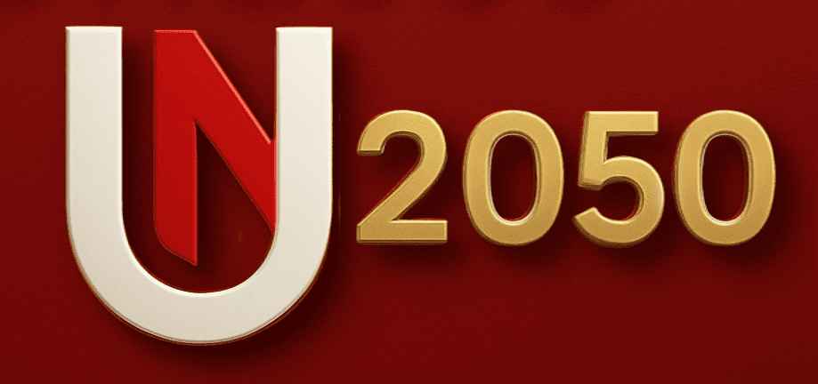

# Un2050

[](https://mohamedmesto.github.io/Un2050_resume/)

[](https://un2050.com/)

---

## Welcome to Un2050

**Un2050** is a visionary platform designed to foster innovation, sustainability, and community-driven progress. This static HTML website serves as a digital hub where users can explore, connect, and collaborate on projects that shape a better future. Whether you’re interested in cutting-edge technology, social impact, or creative initiatives, Un2050 provides a seamless experience for engaging with transformative ideas and solutions. Join us on this journey to build a sustainable, inclusive world by 2050 and beyond!

---

## Live Links

- **[Live Version on GitHub Pages](https://mohamedmesto.github.io/Un2050_resume/)**
- **[Official Website](https://un2050.com/)**

---

## Project Structure

The project is structured as follows:

```
Un2050_resume/
│
├── assets/                  # Static assets (images, CSS, JavaScript, etc.)
│   ├── css/                 # CSS files
│   ├── images/              # Image files
│   ├── js/                  # JavaScript files
│   └── ...                  # Other assets
│
├── index.html               # Main HTML file
├── about.html               # About page
├── projects.html            # Projects page
├── team.html                # Team page
├── contact.html             # Contact page
├── README.md                # This file
└── ...                      # Other HTML files and assets
```

---

## Getting Started

### Prerequisites

- A modern web browser (e.g., Chrome, Firefox, Safari).
- A GitHub account (for deployment).

### Installation

1. Clone the repository:

   ```bash
   git clone https://github.com/MohamedMesto/Un2050_resume.git
   cd Un2050_resume
   ```

2. Open the project in your preferred code editor.

3. Launch the website locally by opening `index.html` in your browser.

---

## Deployment to GitHub Pages

To deploy this static HTML website to GitHub Pages, follow these steps:

1. Push your project to a GitHub repository (if not already done):

   ```bash
   git init
   git add .
   git commit -m "Initial commit"
   git branch -M main
   git remote add origin https://github.com/MohamedMesto/Un2050_resume.git
   git push -u origin main
   ```

2. Go to your repository on GitHub:  
   `https://github.com/MohamedMesto/Un2050_resume`

3. Navigate to **Settings** > **Pages**.

4. Under **Source**, select the `main` branch (or the branch containing your HTML files) and click **Save**.

5. Wait for GitHub to process the deployment. Once done, your site will be live at:  
   **[https://mohamedmesto.github.io/Un2050_resume/](https://mohamedmesto.github.io/Un2050_resume/)**

---

## Customization

To customize the website:

1. Edit the HTML files (`index.html`, `about.html`, etc.) to update content.
2. Modify the CSS files in `assets/css/` to change the styling.
3. Add or update images in `assets/images/`.
4. Update JavaScript files in `assets/js/` for interactive features.

---

## Contributing

Contributions are welcome! If you'd like to contribute, please:

1. Fork the repository.
2. Create a new branch for your feature or bugfix.
3. Submit a pull request.

---

## License

This project is licensed under the MIT License. See the [LICENSE](LICENSE) file for details.

---

## Contact

For questions or feedback, please reach out to [Mohamed Mesto](https://github.com/MohamedMesto).

---


 